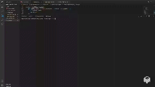

# Employee Tracker

This application is a Employee Tracker.

## Description
This application is a command-line application to manage a company's employee database was made using Node.js, Inquirer, and PostgreSQL.

## Usage
1. Open Terminal.
2. Enter node server.js.
3. Choose one of the following options.

## Technologies Used
- Node.js
- Inquirer
- PostgreSQL

## Test instructions
N/A

## Mock-Up
The following video shows the wed-site appearance and functionality:

To watch a video open this link:
https://drive.google.com/file/d/1BwlZC8cDvqWxsYP7RoxmxalrcQkqlYyt/view?usp=sharing